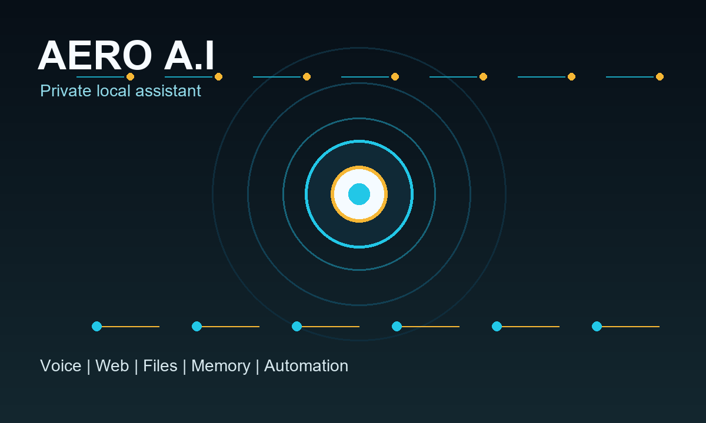
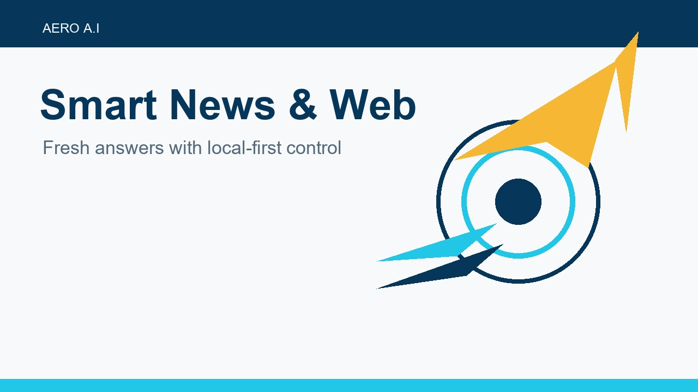

# Aero A.I

<p align="center">
  
</p>

Aero is an intelligent, human-like AI assistant for daily productivity, creativity, and local computer automation. It runs primarily on localhost so the user keeps control of their data while still getting fast voice, text, web, file, and app automation features.

## Project Vision

Aero can answer questions, solve problems, open applications, create and manage files, respond to voice commands, and adapt to user behavior over time. The project is designed as a privacy-first assistant that can work offline for core features and optionally use online AI or web services when needed.

## Core Capabilities

- Question answering and problem solving
- Decision support and contextual reasoning
- Human-like interaction with emotional responses
- Speech recognition and voice replies
- Multilingual communication support
- Context memory and conversation awareness
- Personalization based on user preferences

## Functional Features

### System & Automation

- Open websites and applications such as YouTube, Spotify, WhatsApp, Google, and installed desktop apps
- Launch games and software when available on the system
- Create, rename, delete, and organize files and folders
- Gesture recognition support through OpenCV and face/vision modules
- Smart task automation based on repeated user habits

### Intelligence & Learning

- Neuron-inspired adaptive learning concept
- Learns from user behavior and preferences
- Smart recommendations over time
- Context memory with recall
- Personalization engine for tone, voice, and common tasks

### Productivity Tools

- Notes saving and retrieval
- Document and conversation summarization
- Calculator and unit converter support
- Reminders and alarms
- Weather and time information
- Email and message drafting
- File reading and analysis

### Creative & AI Tools

- Content writing
- Video script ideas
- Poster and logo suggestions
- Image generation workflow support
- Idea brainstorming

### Web & Integration

- Web search
- API integration support
- Offline mode for core features
- Optional online AI enhancements
- Ollama support for local LLM chat

### Privacy & Safety

- Localhost execution for better privacy and speed
- Conversation history controls
- Delete options for stored data
- Parental safe mode concept
- Full user control of local files and assistant data
- No forced cloud storage

## Suggested Architecture

| Layer | Technology |
| --- | --- |
| Frontend | Tkinter desktop UI now; Electron, React, or Flutter can be added later |
| Backend | Python task execution engine |
| Local AI | Ollama or LM Studio |
| Online AI | Optional API integration |
| Speech | SpeechRecognition, pyttsx3, Whisper or Vosk |
| Vision | OpenCV and MediaPipe |
| Memory | Local JSON now; FAISS/vector database can be added |
| Automation | Python OS APIs, webbrowser, subprocess, and file-system tools |

## Current App

This repository includes:

- `aero_ui.py`: desktop UI with typed chat, voice input, live web search, Ollama chat fallback, face recognition launch, and quick action buttons
- `aero.py`: full voice assistant with app, web, news, dictionary, OCR, screenshot, music, and face authentication workflows
- `aero_lite.py`: lightweight command-line assistant for systems without all optional dependencies
- `Aero-Face-Recognition/`: face recognition training and recognition scripts

## Requirements

Install dependencies with:

```powershell
pip install -r requirements.txt
```

Important optional settings:

- `NEWS_API_KEY`: enables NewsAPI headlines. Without it, Aero falls back to Google News.
- `AERO_MUSIC_PATH`: full path to the music file used by the "play music" command.
- `TESSERACT_CMD`: full path to `tesseract.exe` if OCR is installed somewhere other than the default Windows location.
- `AERO_OLLAMA_MODEL`: Ollama model used by the UI for normal chat. Defaults to `llama3.2:1b`.

## Quick Start

### Windows

```powershell
.\setup_aero.bat
.\start_aero_ui.bat
```

Start the full voice assistant:

```powershell
.\start_aero.bat
```

Start without camera or face authentication:

```powershell
.\.venv\Scripts\python.exe .\aero.py --no-auth
```

### Linux / macOS

```bash
python3 -m venv .venv
source .venv/bin/activate
pip install -r requirements.txt
python aero.py
```

On Ubuntu-based systems, install a speech engine:

```bash
sudo apt-get update && sudo apt-get install espeak
```

## Example Commands

```text
open youtube
open app spotify
open app whatsapp
web latest AI news
wikipedia artificial intelligence
search Python automation ideas
news
the time
remember that submit project report tomorrow
do you remember anything
```

WhatsApp message drafting:

```text
whatsapp 919876543210: hello from Aero
```

## Face Recognition Setup

Aero includes a working LBPH face-recognition flow. Train your own local model before using face authentication:

```powershell
.\.venv\Scripts\python.exe "Aero-Face-Recognition\Sample generator.py"
.\.venv\Scripts\python.exe "Aero-Face-Recognition\Model Trainer.py"
.\.venv\Scripts\python.exe "Aero-Face-Recognition\Face recognition.py"
```

Use a numeric ID and your name during sample capture. Face samples are private biometric data, so they are ignored by Git and should stay on your computer.

## Aero Preview

<table>
  <tr>
    <td></td>
    <td></td>
  </tr>
  <tr>
    <td></td>
    <td></td>
  </tr>
  <tr>
    <td></td>
    <td></td>
  </tr>
</table>

## Why Aero Is Unique

- Runs locally for privacy-first usage
- Combines productivity, creativity, and automation
- Supports voice, text, web, files, and computer control
- Designed to learn and adapt to the user over time
- Modular enough for a college project, startup MVP, or research prototype

## Future Enhancements

- Mobile companion app
- Smart home integration
- Emotion detection from voice
- Personalized AI avatars
- Plugin marketplace for skills
- FAISS-backed long-term semantic memory
- MediaPipe gesture commands

## Contribution

Pull requests are welcome. Useful improvements include local LLM integrations, safer file automation, memory upgrades, gesture controls, better UI screens, and expanded test coverage.
